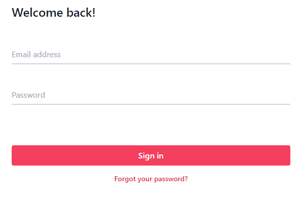

# Tailwind Floating Labels

Notes from here: https://www.youtube.com/watch?v=nJzKi6oIvBA

```console
npm install
npx tailwindcss -i ./src/main.css -o ./dist/output.css --watch
```

---

## What I learned



- `tailwindcss` has a `peer` sibling selector
- `focus:` classes help me change the behavior of elements when a user has an object active

## Alternatives

Bootstrap has `form-floating` classes for styling form inputs with floating behavior.

- https://getbootstrap.com/docs/5.3/forms/floating-labels/
