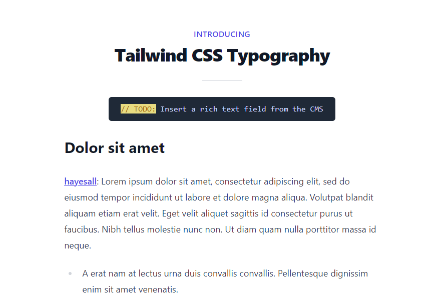

# Tailwind Typography

Notes from here: https://www.youtube.com/watch?v=J0Wy359NJPM

```console
npm install
npx tailwindcss -i ./src/main.css -o ./dist/output.css --watch
```

---

## What I learned



- `tailwindcss` has a typography plugin: https://tailwindcss.com/docs/typography-plugin
- You can install this plugin with: `npm install @tailwindcss/typography`
- This plugin provides access to special classes like `prose`
- When `prose` is added to a parent element, it automatically styles child elements with sensible defaults
- You can further configure the prose class with modifiers like `prose-indigo md:prose-lg lg:prose-xl` (e.g. to configure the color theme or configure different sizes on specific breakpoints)
- This might be useful when you have generated content coming in from a source where you do not *necessarily* control the generation process (e.g. `html->markdown`)

### Alternatives

Another option was demonstrated through the tailwind `@layer components`. If you have an element:

```html
<div class="cms-content">
    <p>Demo text</p>
    <p>More text</p>
</div>
```

You can apply styling to tags which are children of the `cms-content` class like:

```css
@tailwind base;
@tailwind components;
@tailwind utilities;

@layer components {
    .cms-content > h2 {
        @apply text-2xl font-extrabold mt-8 mb-4;
    }
    .cms-content > p {
        @apply mt-6;
    }
}
```
