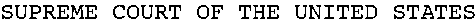

# Naïve Bayes

*Trying to write a clean, concise, and minimal Multinomial Naive Bayes implementation.*

## Problem 1: Denoise Images

| Step | Result |
| :--- | :--- |
| Given a ground-truth image of monospace characters |  |
| ... and a noisy image |  |
| ... produce a de-noised version of the image |  |
| ... and its text. | `SUPREME COURT OF THE UNITED STATES` |
